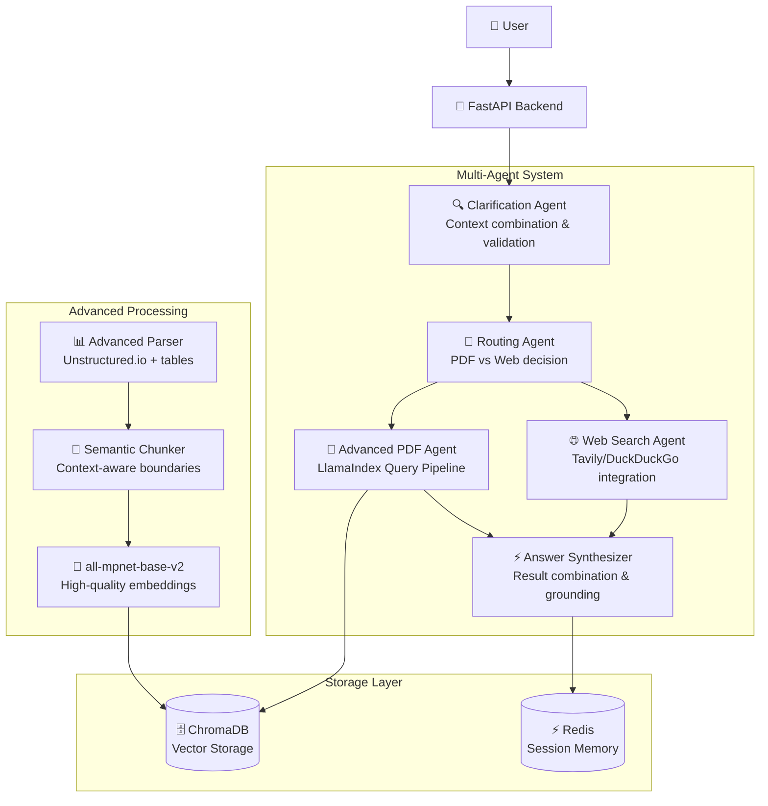

# 📚 Chat-with-PDF Backend

## Overview

This project implements an intelligent Q&A system for academic PDFs using advanced Retrieval-Augmented Generation (RAG) techniques. The system features a multi-agent architecture that provides contextual answers from PDF documents with automatic fallback to web search when needed.

Built with cutting-edge open source libraries including **Unstructured.io** for advanced PDF parsing, **LlamaIndex** for sophisticated query processing, and **semantic chunking** for better context preservation.

⸻

## 🏗️ Architecture Overview



### Agent Descriptions

- **🔍 Clarification Agent**: Combines incomplete questions with conversation context and determines if clarification is needed
- **🧭 Routing Agent**: Intelligently decides between PDF search, web search, or both based on question type
- **📄 Advanced PDF Agent**: Uses LlamaIndex Query Pipeline with multi-query retrieval and sophisticated result synthesis
- **🌐 Web Search Agent**: Integrates multiple search providers with quality filtering and result processing
- **⚡ Answer Synthesizer**: Combines PDF and web results with confidence scoring and source attribution

### Processing Flow

1. **Question Analysis**: Clarification agent processes user input and context
2. **Intelligent Routing**: Router determines optimal search strategy
3. **Advanced Retrieval**: PDF agent uses semantic search with query enhancement
4. **Fallback Logic**: Automatic web search if PDF confidence < threshold
5. **Result Synthesis**: Combine sources with confidence scoring and citations
6. **Context Storage**: Session memory enables follow-up conversations

⸻

## 🛠️ Tech Stack

### Core Framework
- **Python 3.11+** - Modern Python with async/await support
- **FastAPI** - High-performance async web framework
- **Docker** - Containerization with multi-service orchestration

### Advanced RAG Components
- **🔧 Unstructured.io** - Advanced PDF parsing with table/figure extraction
- **🧠 LlamaIndex** - Sophisticated query processing pipeline
- **🎯 Semantic Chunking** - Context-aware document segmentation
- **📊 all-mpnet-base-v2** - High-quality sentence embeddings

### Infrastructure
- **ChromaDB** - Vector database for document storage
- **Redis** - Session memory and caching
- **LangChain** - Multi-query retrieval and agent orchestration

### LLM & Search
- **OpenAI / Anthropic** - Configurable LLM providers
- **Tavily API** - Professional web search with quality filtering
- **DuckDuckGo** - Fallback search provider

⸻

## 🚀 How to Run Locally

### Prerequisites
- Docker and docker-compose installed
- Make utility (available on most Unix systems)
- API keys for LLM providers, here I'm using Anthropic
- Tavily API key for enhanced web search

### Quick Start

1. **Clone the Repository**
```bash
git clone <repository-url>
cd chat-with-pdf
```

2. **Start with Make**

```bash
# Build and start all services
make start

# shut down all services
make stop
```

This starts:
- **Backend API** (Port 8000) - FastAPI service with all agents
- **ChromaDB** (Port 8001) - Vector database for document storage
- **Redis** (Port 6379) - Session memory and caching

3. **Verify Installation**


Access interactive API docs:
- Swagger UI: http://localhost:8000/docs
- ReDoc: http://localhost:8000/redoc

### API Endpoints

#### Document Management
```bash
# Upload PDF document
curl -X POST "http://localhost:8000/ingest" \
  -H "Content-Type: multipart/form-data" \
  -F "file=@your_document.pdf"

# List uploaded documents
curl "http://localhost:8000/documents"
```

#### Question Answering
```bash
# Ask a question
curl -X POST "http://localhost:8000/ask" \
  -H "Content-Type: application/json" \
  -d '{
    "question": "Which prompt template gave the highest zero-shot accuracy on Spider in Zhang et al. (2024)?",
    "session_id": "demo_session"
  }'
```

#### Session Management
```bash
# Get conversation history
curl "http://localhost:8000/sessions/demo_session/history"

# Clear session memory
curl -X POST "http://localhost:8000/clear" \
  -H "Content-Type: application/json" \
  -d '{"session_id": "demo_session"}'
```

⸻

## 📦 Project Structure

```
chat-with-pdf/
├── app/
│   ├── agents/                 # Multi-agent system
│   │   ├── base.py            # Base agent interface
│   │   ├── clarifier.py       # Question clarification & context combination
│   │   ├── router.py          # PDF vs Web routing decisions
│   │   ├── pdf_agent.py       # Multi-query RAG with confidence scoring
│   │   ├── web_agent.py       # Web search integration
│   │   └── synthesizer.py     # Result combination & synthesis
│   │
│   ├── rag/                   # Advanced RAG components
│   │   ├── advanced_parser.py # Unstructured.io PDF parsing
│   │   ├── semantic_chunker.py # Context-aware document segmentation
│   │   ├── query_pipeline.py  # LlamaIndex sophisticated query processing
│   │   ├── embeddings.py      # all-mpnet-base-v2 embedding provider
│   │   ├── vector_store.py    # ChromaDB interface with retriever
│   │   ├── ingestor.py        # Document ingestion orchestrator
│   │   └── chunker.py         # Fallback recursive chunking
│   │
│   ├── graph/                 # System orchestration
│   │   └── orchestrator.py    # Main multi-agent coordinator
│   │
│   ├── api/                   # FastAPI endpoints
│   │   └── routes.py          # REST API routes
│   │
│   ├── memory/                # Session management
│   │   └── session.py         # Redis-based conversation memory
│   │
│   ├── search/                # Web search providers
│   │   ├── tavily_search.py   # Professional search API
│   │   └── duckduckgo_search.py # Fallback search
│   │
│   ├── config.py              # Configuration management
│   ├── startup.py             # Application initialization
│   └── main.py                # FastAPI application entry point
│
├── docker/
│   ├── Dockerfile             # Multi-stage Python container
│   └── docker-compose.yml     # Multi-service orchestration
│
├── Makefile                   # Development workflow automation
│
├── scripts/
│   └── ingest_pdfs.py         # Bulk PDF ingestion utility
│
├── tests/
│   └── e2e_test.py            # End-to-end testing
│
├── requirements.txt           # Python dependencies with advanced libraries
└── README.md                  # This documentation
```

### Key Components

- **Advanced Processing**: Unstructured.io + semantic chunking + LlamaIndex
- **Multi-Agent System**: Clarification → Routing → Retrieval → Synthesis
- **Fallback Architecture**: PDF → Web search → Error handling at every level
- **Session Memory**: Contextual conversations with Redis persistence
- **Production Ready**: Docker containerization with health checks


⸻

## 🔮 Future Improvements

### Immediate Enhancements
- **🎯 BGE Reranker Integration**: Add cross-encoder reranking for higher precision retrieval
- **🔄 Streaming Responses**: Real-time answer streaming for better user experience
- **📈 Advanced Evaluation**: Implement RAGAS framework for comprehensive quality assessment

### Advanced Features
- **🧪 Query Analysis**: Add query classification (factual, analytical, comparative)
- **📍 Citation Highlighting**: Precise page/section references with coordinate mapping
- **🔗 Multi-Document Reasoning**: Cross-reference insights across multiple papers

### Scaling & Production
- **☁️ Cloud-Native Deployment**: Kubernetes with auto-scaling and load balancing
- **🗄️ Vector Database Migration**: Qdrant or Weaviate for production-scale performance
- **🔐 Multi-Tenancy**: User isolation with workspace-based document management
- **📊 Advanced Analytics**: User interaction tracking and system performance metrics
- **🔍 A/B Testing Framework**: Continuous improvement through experimentation

### Quality & Reliability
- **🎯 Golden Q&A Dataset**: Curated evaluation pairs for consistent quality measurement
- **🛡️ Hallucination Detection**: Advanced consistency checking and source grounding
- **⚡ Performance Optimization**: Response caching and smart prefetching
- **🔄 Continuous Learning**: User feedback integration for model improvement

---

## 📋 Development Checklist

### ✅ Core Implementation
- [x] Multi-agent architecture with intelligent routing
- [x] Advanced PDF parsing with Unstructured.io
- [x] Semantic chunking for context preservation
- [x] LlamaIndex query pipeline integration
- [x] Session-based conversation memory
- [x] Automatic fallback mechanisms
- [x] Docker containerization

### ✅ Production Ready
- [x] Comprehensive error handling
- [x] Health checks and monitoring
- [x] API documentation (OpenAPI/Swagger)
- [x] Environment configuration management
- [x] Multi-service orchestration

### ✅ Documentation
- [x] Architecture overview with diagrams
- [x] Complete setup instructions
- [x] API usage examples
- [x] Future improvement roadmap

---
